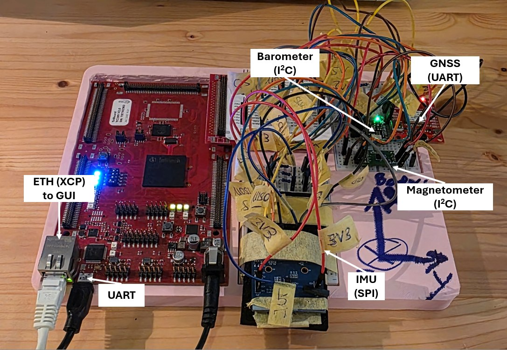
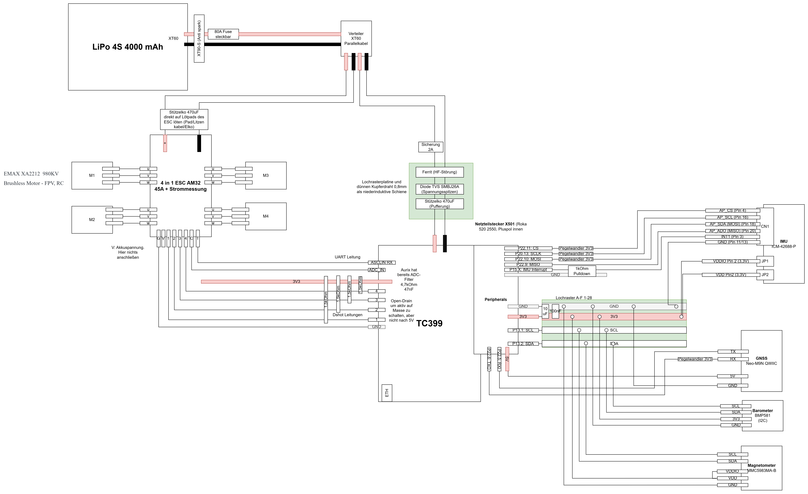

# AurixTricore

Bare-metal firmware for the Infineon **AURIX TC399** (6× TriCore, 300 MHz) on the
TriBoard TC3X9 V2.0. No RTOS — a cooperative scheduler per core, iLLD for the
hardware, lwIP for Ethernet.

A flight-controller platform: an Ethernet-attached measurement and calibration
target that reads inertial, barometric, magnetic and GNSS sensors, monitors its
own health, and exposes all of it live over **XCP-on-UDP** to a PC GUI.

**Firmware version: v1.19.13** (`src/bsw/Version.h`) · Hardware-validated on the
bench.

### Companion repositories

This is the firmware half of a three-repository project.

| Repository | Owns |
|---|---|
| **AurixTricore** (here) | Firmware, drivers, XCP memory map, A2L generation, replay protocol |
| [**AurixGUI**](https://github.com/crengineering/AurixGUI) | Qt6 measurement and calibration GUI — XCP client, A2L-driven views, MF4 logging |
| [**Quadrocopter**](https://github.com/crengineering/Quadrocopter) | Simulink 6-DoF model, controller design, MiL/SiL/PiL verification — the origin of `src/asw/flight_ctrl.c` |

---



*TriBoard TC3X9 V2.0 running v1.18.0. ICM-42688-P on QSPI0, BMP581 and MMC5983MA
sharing I2C0, NEO-M9N on ASCLIN4, RGMII to the host running AurixGUI, console on
ASCLIN0 over the on-board USB-to-UART. Every pin is listed in
[`docs/PINNING.md`](docs/PINNING.md).*

### System architecture

[](docs/img/system-architecture.png)

*System architecture. Power distribution from the pack through the XT90-S
anti-spark connector, an 80 A fuse and the XT60 splitter to the 4-in-1 ESC and
the four motors. A separately fused 2 A branch feeds the board's X501 connector
through a ferrite, a TVS diode and a 470 µF buffer. On the signal side, every
sensor line off the peripherals header including the level shifting and the
pull-ups. Click to open full size and zoom.*

> **Target design, not yet built.** The sensor and Ethernet half is implemented and
> hardware-validated; the propulsion half — LiPo, fusing, ESC, motors and the DShot
> lines to them — is the planned architecture. DShot is an open item in
> [Status](#status).

Source: [`docs/system-architecture.drawio`](docs/system-architecture.drawio), editable in
[diagrams.net](https://app.diagrams.net/). The PNG is an editable export too, so
either file reopens as a diagram.

---

## What runs today

| Area | State |
|---|---|
| 6-core boot + sync barrier, both watchdogs disabled | ✅ |
| Cooperative scheduler (`SCHED_MS(n)`, 8 tasks/core) | ✅ |
| Ethernet: RGMII + RTL8211F PHY + lwIP, static `192.168.0.10` | ✅ |
| TCP + UDP echo (port 7), XCP-on-UDP slave (port 5555) | ✅ pyXCP-validated |
| XCP: SHORT_UPLOAD polling, calibration writes, DAQ | ✅ |
| Persistent parameters in DFLASH0 (2-sector ping-pong + CRC) | ✅ |
| BMP581 barometer (I2C0 `0x47`) | ✅ HW-validated |
| MMC5983MA magnetometer (I2C0 `0x30`) | ✅ HW-validated |
| ICM-42688-P IMU (QSPI0) | ✅ HW-validated |
| u-blox NEO-M9N GNSS (ASCLIN4, interrupt-driven UBX) | ✅ HW-validated |
| Attitude: quaternion Mahony over accel + gyro + mag | ✅ HW-validated — `docs/FUSION.md` |
| Vertical channel: altitude, climb rate, accelerometer bias | ✅ HW-validated |
| Horizontal channel: GNSS pos/vel in a NED tangent plane | ✅ HW-validated outdoors |
| Magnetometer hard-iron calibration, stored in NVM | ✅ HW-validated — \|B\| spread 135 % → 13 % |
| Live estimator tuning over XCP (`Xcp_FusionCal`, RAM only) | ✅ HW-validated |
| Flight-control feedback in `flight_ctrl`'s own units and frames | ✅ published |
| Spec-based host test suite for the estimator | ✅ 9 tests — `docs/FUSION_SPEC.md` |
| Diagnostics: 28 debounced status bits, per-device peripheral health | ✅ |
| GPIO / PWM feature on Port 00 (GTM TOM), XCP-controlled duty | ✅ |
| Flight-control replay harness (UDP 5556) | ✅ |
| Host unit tests + MISRA gate in CI | ✅ |
| DShot ESC output, CAN, EVADC | 📋 planned — `docs/PINNING.md`, `docs/CAN_ADC_PLAN.md` |

**CPU1 is the dedicated flight core** (`NavTask_step`: IMU read → AHRS →
fusion, ~0.7 % load, 50 Hz today) — CPU0 keeps comms, sensors and
housekeeping at ~9.4 %; CPU2–CPU5 remain idle. See [Status](#status).

---

## Hardware & toolchain

| Component | Details |
|---|---|
| Board | AURIX TC3xx Starter Kit 2nd Gen (TriBoard TC3X9 V2.0) |
| MCU | TC399XX-256, step BD, LFBGA-516, 6× TriCore @ 300 MHz, 16 MB PFLASH |
| PHY | RTL8211F (RGMII on Port 11) |
| Debug / flash | On-board DAP over Micro-USB (no external probe) |
| Console | X109 USB-to-UART, ASCLIN0, 115 200 8N1 |
| IDE | AURIX Development Studio 1.10.32 |
| Compiler | TASKING VX-toolset for TriCore (non-commercial), v1.1r8 |
| Drivers | iLLD 1.20.0 (`Libraries/iLLD/` — do not edit) |
| Flasher | AURIX Flasher Software Tool 3.0.16.0 |
| Host OS | Windows |

Build config: **TriCore Debug (TASKING)** → `AurixTricore.elf` / `.hex`.
`DEVICE_TC39XB` **must** be defined in the compiler's preprocessing symbols —
without it `IfxPort.c` takes the wrong `#else` branch and GPIO silently fails.

---

## Quick start

### Build

```bat
build.bat            :: incremental, headless (works while ADS is open)
build.bat clean      :: full rebuild, after any header change
```

Or in the IDE: `Project → Clean`, then `Ctrl+B`. Expected:
`Build Finished. 0 errors, 0 warnings.`

### Flash

```bat
flash.bat            :: AURIXFlasher, erase + program + verify
erase_flash.bat      :: full chip erase
```

### Watch it run

```bat
python tools\uart_cap.py                 :: console — start BEFORE flashing
python tools\xcp_read.py g_TickCount_1ms :: read ANY global off the live board
python tools\xcp_test.py                 :: XCP slave validation (pyXCP)
python tools\nvm_test.py                 :: DFLASH persistence + RAM/NVM split
python tools\gpio_pwm_test.py            :: GPIO/PWM feature validation
```

`xcp_read.py` is the fastest debug loop in the repo: SHORT_UPLOAD accepts any
address, so any global in the map file can be watched live — no `Xcp_Data`
field, no A2L entry, no GUI change needed.

The `/bringup` skill wraps the whole build → flash → observe cycle.

---

## Architecture

### BSW / ASW split

```
src/bsw/   Base software — owns all hardware and generic services.
           Never includes an ASW header.
src/asw/   Application software — calls BSW only, never iLLD/SFR directly.
           Runs on CPU1…CPU5; publishes via its own XCP block.
```

The rule exists so the compute half stays host-testable (see `docs/TESTING_PLAN.md`
§A1). `flight_ctrl.c` is byte-identical to its original in the
[Quadrocopter](https://github.com/crengineering/Quadrocopter) repository for
exactly this reason — the same translation unit runs as a Simulink S-function, as
a PC reference and here on the target, which is what makes the replay comparison
meaningful. Controller design, tuning and the MiL/SiL verification live there.

### Core allocation

| Core | Role | LED |
|---|---|---|
| CPU0 | Ethernet/lwIP, XCP, sensors, diagnostics, NVM, housekeeping | D306 (P20.11) |
| CPU1 | **flight core** — `NavTask_step` (IMU → AHRS → fusion), nothing else but the LED | D307 (P20.12) |
| CPU2 | sync + 10 ms idle task | — (D308's pin is now QSPI0 SCLK) |
| CPU3 | sync + 10 ms idle task | D309 (P20.14) |
| CPU4/5 | sync + 10 ms idle task | — |

Every `coreN_main` **must** call `IfxCpu_emitEvent` *and* `IfxCpu_waitEvent`
before any application code — skipping either on any core causes a watchdog
reset. Each core uses its own STM module (`MODULE_STM0` → CPU0, …).

Cross-core data follows one pattern, documented in `SharedRam.h`: shared
objects live in the LMU at a **non-cached alias**, `volatile`, all-32-bit,
**single writer**, publish ordered by *payload → barrier → generation
counter*, reader retries once on a torn read. Reuse it rather than inventing a
second scheme — see `docs/CODEMAP.md` §3. `CoreStats.h` is diagnostic
counters only, tolerant of a torn read, not this pattern.

### Fixed XCP memory map

Blocks are pinned with TASKING `__at`, 256 bytes apart, so clients need no map
file:

| Block | Address | Backing | Defined in |
|---|---|---|---|
| `Xcp_Data` — live measurements | `0x70030000` | RAM | `Measurements.h` |
| `Xcp_Cal` — calibration | `0x70030100` | **RAM only**, lost on reset | `Diagnostics.h` |
| `Xcp_Nvm` — persistent params | `0x70030200` | DFLASH0 | `Nvm.h` |
| `Xcp_Gpio` — pin modes / duty | `0x70030300` | RAM only | `gpio.h` |
| `I2c_Debug` — bus diagnostics | `0x70030400` | RAM only | `I2c.h` |
| `Xcp_Fusion` — navigation state | `0x70030500` | RAM only | `Measurements.h` |

`Xcp_Data` is **full**: its last field ends within 8 bytes of the 256-byte
boundary, so the next appended measurement collides with `Xcp_Cal`.

That is why the navigation state lives in its own block. `Xcp_Fusion`
(`0x70030500`, 188 bytes) took the next free slot rather than growing
`Xcp_Data`, so no existing address moved and every A2L entry, GUI plot and
hard-coded tool address stayed valid. The seven original fusion fields are
*still written* inside `Xcp_Data` for exactly that reason. **Reuse this pattern**
before considering a re-spacing of the map. See *Status → Open*.

The offset comment block in `Measurements.h` is the layout SSoT. **Append new
fields; never insert** — an insert silently shifts every A2L entry and GUI plot
below it.

### Network endpoints

| Port | Protocol | Service |
|---|---|---|
| 7 | TCP + UDP | echo (`Echo.c`, `UdpEcho.c`) |
| 5555 | UDP | XCP slave — poll, calibration writes, DAQ (`Xcp.c`) |
| 5556 | UDP | flight-control replay: 16 floats in → 17 floats + ticks out (`CtrlReplay.c`) |

Static IP `192.168.0.10/24`, set in `Cpu0_Main.c`.

### Sensors

| Part | Bus | Address | Rate | Doc |
|---|---|---|---|---|
| ICM-42688-P IMU | QSPI0 | SLSO10 | 50 Hz | `docs/ICM42688P.md` |
| BMP581 barometer | I2C0 | `0x47` | 50 Hz | `docs/BMP581.md` |
| MMC5983MA magnetometer | I2C0 | `0x30` | 50 Hz | `docs/MMC5983MA.md` |
| u-blox NEO-M9N GNSS | ASCLIN4 | UART 38 400 | 10 Hz | `docs/GNSS_UBX.md` |

`Bmp388.c` and `Mpu6050.c` remain in-tree as a validated driver pool — compiled,
never called, held with justified MISRA 8.7 deviations.

**`docs/PINNING.md` is the single source of truth for every pin.** Read the whole
relevant section before wiring; contradicting it has cost days.

---

### Sensor fusion

Five sensors, two estimators, one state. Full detail in **`docs/FUSION.md`**.

```
accelerometer + gyro + magnetometer ──► Ahrs.c    quaternion Mahony
                                              │
                          acceleration in NED, gravity removed
                                              │
barometer + GNSS ─────────────────────► fusion.c  three Kalman channels
                                        DOWN / NORTH / EAST, four states each:
                                        position, velocity, accel bias, meas bias
```

Everything runs in `NavTask_step` at 50 Hz on **CPU1**, the dedicated flight
core, and costs about 0.7 % of it — see `docs/FUSION.md` §1.
Frame is NED throughout, so **`d` is positive downward**.

Why a cascade and not one 15-state EKF: attitude converges in seconds from two
vectors that never drift, position takes minutes and needs a receiver that is
absent indoors. Splitting them meant the vertical channel could be validated on
a desk with a 30 cm lift, months before anything flies.

**Measured on this board:**

| | |
|---|---|
| attitude | nose-up → pitch +80°, right-wing-down → roll +92°, \|a\| 0.99–1.01 |
| magnetometer calibration | \|B\| spread with orientation **135 % → 13 %** |
| vertical channel | 3.6× high-frequency rejection, climb-rate noise **18 mm/s** |
| 30 cm lift, held | +0.27 m sustained, innovation inside ±0.02 m |
| GNSS outdoors | 2398 fixes at **10.00/s**, loop closure **2.59 m** vs hAcc 2.4 m |
| `baroBias` | converged **1.92 → 0.01 m** once GNSS made it observable |

**Tuning is live.** Every constant sits in `Xcp_FusionCal` (`0x70030600`,
RAM only) and is read every tick, so a tuning pass is a slider in the GUI rather
than a rebuild and a reflash. Each parameter carries its rationale in the A2L,
which the GUI shows as a description column. `FusSigmaAccDown` is the one to
reach for once motors turn: 0.3 was measured on a desk, and vibration is not in
it.

**The flight controller's feedback is published in its own units and frames** —
`phi_ist`/`om_ist` in radians, `p_ned_ist` in metres, and `v_b_ist` rotated into
**body** axes, because it is a damping term and NED velocity would make the
damping wrong by the heading angle.

⚠️ **The barometer measures air, not height.** An abrupt hand movement produced
a +2.3 m transient that rang and returned to baseline, against a real 0.3 m
displacement — the sensor reporting pressure it genuinely saw. A smooth lift
held for 20 s tracks to a centimetre. Always lift *and hold*; a tap cannot
distinguish the two. This is a preview of prop wash, and the mitigation is
physical (foam or a static port), not filtering.

---

## Repository layout

```
src/bsw/              Base software (see Architecture above)
src/asw/              Application software — flight_ctrl.c, CtrlReplay.c
test/                 Host unit tests: vendored Unity 2.7.0, CMake, fakes
tools/                Python: on-target integration tests + host test/MISRA runners
docs/                 Pin SSoT, per-peripheral notes, plans, A2L, vendor PDFs
configs/              GUI plot configurations
Configurations/       PLL init, boot mode header, startup software, lwipopts
Libraries/Ethernet/   lwIP + Infineon port + RTL8211F PHY driver
Libraries/iLLD/       Infineon Low-Level Driver — do not edit
Libraries/Infra/      SSW / SFR infrastructure — do not edit
.github/workflows/    misra.yml, unit_tests.yml
build.bat flash.bat erase_flash.bat test_replay.bat
```

A companion **AurixGUI** (separate repo, Qt) is the XCP master: live plots,
calibration tab, diagnostics table, MF4 logging.

---

## Tests & CI

Two independent layers:

**Host unit tests** — `src/` compiled with GCC, no hardware, milliseconds.
This is where the failure paths live that the bench cannot produce: counter
wraparound, CRC mismatch, both NVM sectors claiming to be newest.

```bat
python tools\utest.py                    :: build + run (CTest)
python tools\utest.py --variant coverage :: gcovr HTML report
python tools\utest.py --variant sanitize :: ASan + UBSan (CI only — no libasan on MinGW)
```

**On-target integration tests** — `tools/xcp_test.py`, `nvm_test.py`,
`ctrl_replay_test.py`, `gpio_pwm_test.py`: real board, real peripherals, pyXCP
over Ethernet. Complementary, not a substitute.

**CI** (GitHub Actions, `ubuntu-latest`):

| Workflow | Checks |
|---|---|
| `unit_tests.yml` | unit tests · ASan+UBSan · coverage (artifact + summary) · warnings at `-Og` and `-Os` |
| `misra.yml` | cppcheck MISRA addon (pinned 2.21.0) over `src/` |

The MISRA gate uses a **baseline ratchet**: legacy findings are grandfathered in
`tools/misra_baseline.txt`, only *new* violations fail. New code should be
MISRA-clean — fix, don't baseline. Justified deviations:
`/* cppcheck-suppress misra-c2012-X.Y ; deviation: reason */`.

Both workflows keep the YAML thin and the work in `tools/*.py`, so every check
reproduces locally with one command.

---

## Documentation index

| File | What it answers |
|---|---|
| `CLAUDE.md` | Build/flash commands, hard rules, commit conventions |
| `docs/CODEMAP.md` | "What does this change touch?" — chains crossing code ↔ A2L ↔ GUI ↔ docs |
| `docs/PINNING.md` | **Pin SSoT** — every allocated, planned, board-fixed and free pin |
| `docs/DIAGNOSTICS.md` | Diagnostic bit meanings, calibration block |
| `docs/ILLD_NOTES.md` | Vendor-driver traps — read before grepping 801 iLLD files |
| `docs/TESTING_PLAN.md` | Test/CI strategy and the remaining stages |
| `docs/BMP581.md` etc. | Per-peripheral wiring and bring-up notes |
| `docs/FUSION.md` | **Sensor fusion** — architecture, bench numbers, mounting transforms, calibration procedure, and the failure modes already hit |
| `docs/FUSION_SPEC.md` | **What the estimator must do**, stated independently of how it does it — the source the test suite is written from |
| `docs/CTRL_REPLAY.md` | Replay harness protocol |
| `docs/CAN_ADC_PLAN.md` | MCMCAN + EVADC plan (blocked on hardware) |
| `docs/AurixTricore.a2l` | ASAP2 description for XCP masters — generated by `tools/gen_a2l.py`, gated by CI |
| `docs/SPI_IMU.html` | How SPI reaches the flight IMU — QSPI0 bring-up walkthrough |
| `docs/aurix-timers.html` | AURIX TC399 timer overview — STM, GTM, and which to use when |
| `docs/xcp-layers.html` | How a value travels through the stack — from a C struct to a GUI plot |

---

## Status

### Done

**Platform**

- [x] 6-core boot with a full sync barrier; both watchdogs handled correctly
- [x] Cooperative scheduler per core (`SCHED_MS(n)`, 8 tasks/core) — no RTOS
- [x] PLL init via SSW, STM at ~100 MHz, one STM module per core
- [x] Lock-free cross-core data pattern — non-cached LMU alias, single writer,
      generation-counter publish/retry — documented once in `SharedRam.h` and
      reused for the flight core's nav-state and sensor-latch crossings
- [x] **CPU1 split off as the dedicated flight core** (`NavTask_step`: IMU
      read → AHRS → fusion), so the estimator no longer shares a core with
      blocking I2C reads or a DFLASH erase — `docs/REFACTORING_PLAN.md` T12

**Communication**

- [x] RGMII + RTL8211F PHY brought up, lwIP integrated, static `192.168.0.10`
- [x] TCP and UDP echo servers (port 7)
- [x] XCP-on-UDP slave (port 5555): SHORT_UPLOAD polling, calibration writes, DAQ
      — validated against pyXCP
- [x] Flight-control replay endpoint (port 5556) with on-target cycle-time
      measurement — see `docs/CTRL_REPLAY.md`
- [x] A2L generated from the C structs (`tools/gen_a2l.py`), so the GUI's view of
      memory cannot silently drift from the firmware's

**Sensors and fusion**

- [x] ICM-42688-P IMU over QSPI0 — HW-validated, |a| = 0.998 g at rest
- [x] BMP581 barometer over I2C0 — HW-validated, 954.6 hPa / 27.8 °C
- [x] MMC5983MA magnetometer over I2C0 — HW-validated, sphere-fit residual 0.9 %
- [x] u-blox NEO-M9N GNSS over ASCLIN4 — HW-validated, 12 satellites, interrupt-
      driven UBX framing with a 512-byte ring buffer
- [x] **Attitude**: quaternion Mahony over accelerometer, gyro and magnetometer,
      with boot gyro-bias calibration and analytic alignment. Bench-verified:
      nose-up → pitch +80°, right-wing-down → roll +92°, |a| 0.99–1.01
- [x] **Navigation**: three 4-state Kalman channels (down/north/east), each
      estimating position, velocity, accelerometer bias and — on the vertical
      channel — the barometer's offset against GNSS altitude
- [x] **Magnetometer calibration** (`tools/mag_cal.py`, stored in DFLASH): |B|
      spread with orientation 135 % → 13 %, corrected magnitude 0.4655 G against
      ~0.48 G expected for Munich
- [x] **Outdoor validation**: 2398 GNSS fixes fused at exactly 10.00/s, loop
      closure 2.59 m against hAcc 2.4 m, zero rejects, zero numerical faults.
      `baroBias` converged 1.92 → 0.01 m — that state is only observable with
      barometer and GNSS altitude both present, so it had never run before

**Robustness**

- [x] In-house bounded I2C transfer engine replacing the iLLD calls, which spin
      unbounded and could hang CPU0 permanently — verified hang-immune under
      60 s of deliberate wire-wiggling
- [x] I2C bus recovery (9 SCL pulses + kernel and FIFO reset) so a slave
      brown-out no longer takes every device on the bus down until a power cycle
- [x] 28 debounced diagnostic status bits, four fault classes per peripheral
- [x] Persistent parameters in DFLASH0: two-sector ping-pong with CRC, strict
      RAM/NVM split so a calibration experiment can never brick the stored set

**Engineering practice**

- [x] Host unit tests — `src/` compiled with GCC against hand-written iLLD fakes,
      runs in milliseconds with no hardware attached
- [x] MISRA C:2012 gate in CI (cppcheck, pinned), legacy findings baselined so
      only *new* violations fail the build
- [x] A2L drift gate in CI — the committed A2L must match what the structs generate
- [x] Headless build and flash scripts (`build.bat`, `flash.bat`) — no IDE needed
- [x] Distilled vendor documentation under `docs/` (`ILLD_NOTES.md`, per-peripheral
      notes, `PINNING.md` as the pin SSoT) so findings are written down once

### Open

- [ ] **`Xcp_Data` is full.** The last field ends within 8 bytes of the
      256-byte boundary, so the next measurement collides with `Xcp_Cal`.
      The navigation state sidestepped this by taking its own block —
      `Xcp_Fusion` at `0x70030500` — which moves no existing address and keeps
      every A2L entry, GUI plot and hard-coded tool address valid. That is the
      pattern to reuse; re-spacing the map is a coordinated change across
      firmware, A2L and GUI (`docs/CODEMAP.md`).
- [ ] **Diagnostic bit word is full.** All 32 bits are allocated (bit 31 is
      `DIAG_CAL_INVALID`). A fifth peripheral needs a second bitmask word.
- [ ] **CPU2–CPU5 still idle.** CPU1 now carries the flight chain (~0.7 %
      load); the rest of CPU0's load — I2C sensors, GNSS, NVM, comms — is
      deliberately unmoved (`docs/REFACTORING_PLAN.md` §2.2, D1). Next up:
      raising `NavTask_step` from 50 Hz to the IMU's measured 1014.2 Hz
      (`docs/REFACTORING_PLAN.md` T14–T16), not yet done.
- [ ] **DShot ESC output** — bidirectional DShot300 on GTM ATOM0/TIM, with RPM
      feedback for a notch filter. Pins allocated in `docs/PINNING.md`, driver
      not yet written.
- [ ] **CAN (MCMCAN) and EVADC** — planned in `docs/CAN_ADC_PLAN.md`, blocked on
      test hardware.
- [ ] **Reported uncertainty is ~8× optimistic.** `varN` claims σ = 0.3 m while
      the measured loop closure was 2.59 m. Consecutive 10 Hz NAV-PVT solutions
      are not independent — the receiver filters internally at the nav rate — so
      the filter counts correlated samples as fresh evidence. The *position* is
      fine; `varN` is not yet trustworthy as a quality signal, so nothing
      downstream should gate on it. Fix by inflating the position R (**not** by
      decimating: GNSS velocity is Doppler-derived and genuinely fresh at
      10 Hz). See `docs/FUSION.md` §7.
- [ ] **GNSS measurement latency (~100–180 ms) is unmodelled** — invisible at
      walking pace, 1.5–2.7 m at 15 m/s. `gnssITow` is published so the fix can
      be timestamped when it starts to matter.
- [ ] **Prop wash and motor vibration** — the two things no bench test reaches.
      The barometer is a pressure sensor in a downwash and will need foam or a
      static port; `FUSION_SIGMA_A_D` must be re-measured with motors turning.
- [ ] **Branch protection** — CI checks are informational rather than required,
      which needs GitHub Pro on a private repository (`docs/TESTING_PLAN.md`
      stage 6). A versioned `pre-push` hook is the free substitute.
- [ ] **EUI-48 MAC from the I2C EEPROM** instead of the hard-coded address.

---

## Hard-won gotchas

Each of these cost real time. Full accounts live in the linked docs.

**1. P22.7 and P22.8 are unusable on this TriBoard.** Driven as plain GPIO with
nothing attached they read back stuck-high, while unwired neighbours on the same
port work perfectly. The IMU returned `WHO_AM_I = 0x00` because SCLK never
reached it. SCLK moved to **P20.13**, costing CPU2 its LED. The technique that
found it — the **pad self-test** (`padSelfTestPort()` in `Cpu0_Main.c`: drive a
pin, read its own pad back, always with unwired control pins) — is meter-free and
worth reusing.

**2. iLLD I2C emits no STOP by default.** The module's `SOPE`
(`stopOnPacketEnd`) defaults to 0 and the per-device `enableRepeatedStart` field
is dead code. The MPU-6050 froze its data registers mid-burst and looked like a
dead die for days. `src/bsw/I2c.c` is an in-house **bounded** transfer engine
(10 ms deadline on every wait) because the iLLD spins are unbounded and hung CPU0
forever.

**3. `IfxI2c_I2c_initModule()` does not clear the I2C kernel or FIFOs.** After a
slave brown-out the master's RX path stays wedged permanently — writes succeed,
reads fail, and it *never NAKs* (that's the tell). One wedged master kills every
device on the bus. Recovery needs `IfxI2c_resetModule()` + `IfxI2c_resetFifo()`
plus 9 SCL pulses.

**4. STM runs at ~100 MHz after PLL init** (automatic via
`IFX_CFG_SSW_ENABLE_PLL_INIT = 1`), so `50 000 000 ticks ≈ 500 ms`.

**5. Both watchdogs must be disabled** — CPU watchdog on every core, safety
watchdog on CPU0.

**6. New iLLD subsystems are `.cproject`-excluded by default.** Adding a bus
means un-excluding its directory *and* using root-relative include paths.

---

## Contributing

- **Conventional Commits** (`type(scope): description`) — full table in `CLAUDE.md`.
- Update `docs/PINNING.md` in the *same* change that moves a pin.
- Bump `src/bsw/Version.h` on a release, then **confirm the version over XCP** —
  a stale `.src` will ship the old string without complaint.

---

## Safety notice

This is a personal engineering project, not a product. Nothing here is
functionally safe, safety-certified, or qualified to any automotive or aviation
standard (ISO 26262, DO-178C or otherwise). The MISRA C:2012 gate and the unit
tests raise code quality; they do not make the software airworthy.

`src/asw/` contains flight-control code and `docs/PINNING.md` allocates pins for
DShot ESC output. Spinning propellers are dangerous. If you run any of it on real
hardware: **remove the propellers**, secure the frame, keep the battery
disconnected until the last moment, and understand that you do so entirely at
your own risk. See the warranty and liability disclaimer in `LICENSE`.

---

## License

[MIT](LICENSE) © 2026 Chris Riedl — for the original work in this repository:
`src/`, `tools/`, `docs/`, `configs/`, `test/` (excluding `test/unity/`),
`.github/`, the linker scripts and the build scripts.

`Libraries/` and `Configurations/` are vendored third-party code that stays under
its own licences — Infineon iLLD, SSW/SFR infrastructure, the CpuGeneric service
layer and the Ethernet port under the **Boost Software License 1.0**, lwIP under
**BSD-3-Clause**, Unity under **MIT**. All are permissive and redistributable,
and every original licence header is preserved. Full table with SPDX identifiers
and upstream sources, plus the scope of the MIT grant and the trademark notice:
[THIRD_PARTY.md](THIRD_PARTY.md).

Infineon datasheets and reference manuals are **not** redistributed here.

AURIX™, TriCore™ and Infineon® are trademarks of Infineon Technologies AG, used
here descriptively to identify the target hardware. No affiliation or
endorsement is implied.

---

## Resources

- [AURIX Development Studio](https://www.infineon.com/cms/en/tools/aurix-development-studio/)
- [TriBoard TC3X9 User Manual](https://www.manualslib.com/manual/1496611/Infineon-Triboard-Tc3x9-Th.html)
- [Infineon AURIX Community](https://community.infineon.com/t5/AURIX/bd-p/AURIX)
